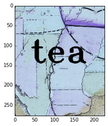
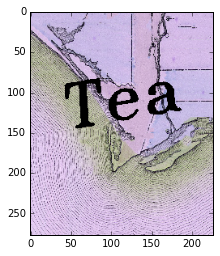
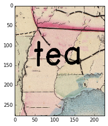
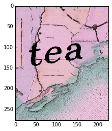
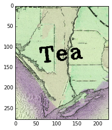
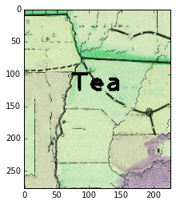

# This is an implementation of Siamese Network in tensorflow.

### Main task to identify same word images as that of the given word image.
### Network was trained to identify words irrespective of their fonts and case.

##### Example:

##### Original query image

##### Top 5 similar words out of 30 test images

###### Result-1

###### Result-2

###### Result-3

###### Result-4

###### Result-5

